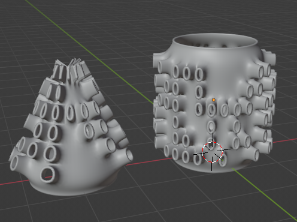
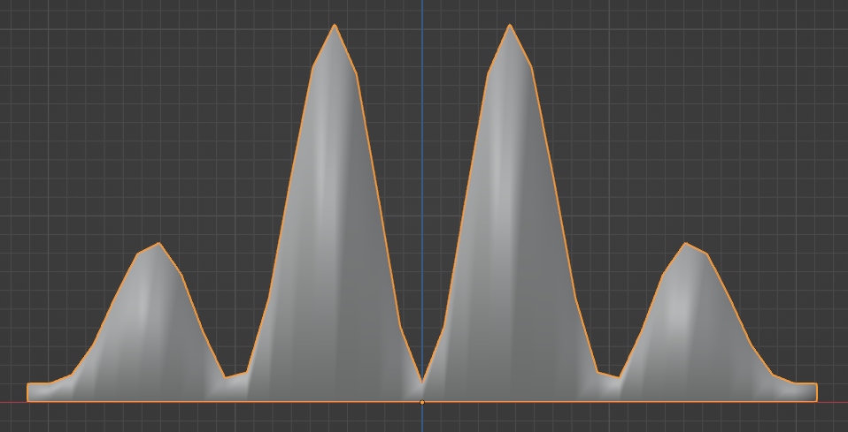
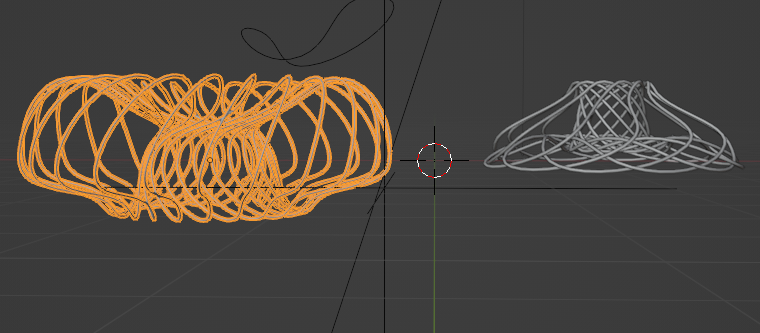
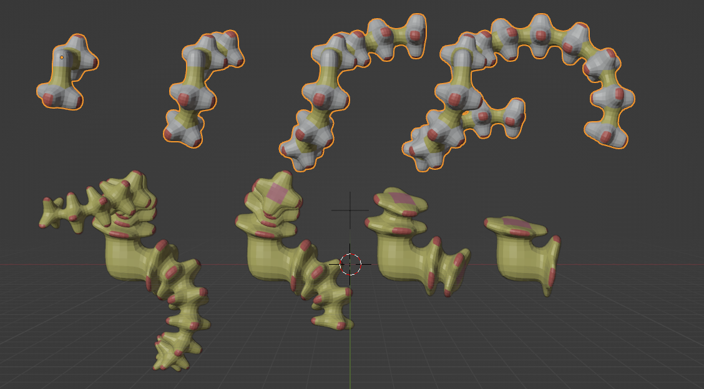

# bpybeatnodes
blender library for parametric shape modeling and generation

## shape_modifiers.blend

This blend file contains several geometry node trees for the purpose of modifying shapes in an interesting and parametric way. 

### RandomExtrudeHole

| Parameter | Description |
| ----------- | ----------- |
| Probability | Probability of random selection |
| ExtrudeLength | Length of extrusion |
| HoleScale | Scale of holes |

### doo_sabin

Geometry nodes implementation of doo_sabin

| Parameter | Description |
| ----------- | ----------- |
| eyesize | size of face shrinkage |
| DeleteSelection | items for deletion - 0 for none, 1 for all, or can select a vertex group. |

### ShrinkArray

work in progress

### TopCut

work in progress

### RandomFaceDelete

work in progress

## wave_generator.blend

### frequency_wave
Variable frequency wave generator

## roto_knots.blend

## animation_helper.blend

### timePong
A utility nodetree to simplify repeating animation cycles. 
| Parameter | Description |
| ----------- | ----------- |
| LoopFrames | Number of frames per repeat cycle |
| Min   | Min value in repeat cycle |
| Max | Max value in repeat cycle

## environment_worlds.blend

- SunSky_Noon
- SunSky_Sunset

## beat_helper.blend

### Beat_Mapper
A utility node group to assist mapping sound frequencies to animations. 

## rotate_extrude.blend

